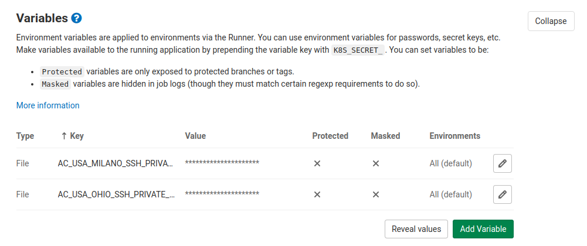

There are two ways of deploying frontend apps, via `ftp` (with [lftp](https://lftp.yar.ru/)) or via `ssh` (with [rsync](https://it.wikipedia.org/wiki/Rsync)).

## Env variables

These are the `.env` variables related to the deployment process. See other [environment variables here](./../configuration.md).

- `CI_VISIT_MODE`: see below [Visit urls automatically](#visit-urls-automatically)
- `CI_CLEAR_CACHE`: default value `data`. Allowed values are either a comma separated list of tags among `data,structure,routes,models,forms,img` or `false` to signal that we do not want to empty any cache, see [cache docs](../laravel-frontend/Cache.md).

## FTP deploy

Sample `.gitlab-ci.yml` file:

```yml
# Cache modules in between jobs
cache:
  key: ${CI_COMMIT_REF_SLUG}
  paths:
    - .npm/

# Always run npm ci (requires a package-lock.json) or npm i
before_script:
  - npm ci --loglevel silent --cache .npm --prefer-offline

# Deploy to dev environment (via ftp):
deploy-to-dev:
  stage: deploy
  only:
    - master
  script:
    - olmo deploy --env dev --mode ftp --folder ./myproject --host dev.mycompany.com --username myusername --password mypassword

# Deploy to production environment (via ftp):
deploy-to-dev:
  stage: deploy
  only:
    - production
  script:
    - olmo deploy --env production --mode ftp --folder ./myproject --host myproject.com --username myusername --password mypassword
```

## SSH deploy

1. First you need to set the SSH key in the CI options of your project https://git.company.net/myproject/-/settings/ci_cd 
2. Edit and add a file `.gitlab-ci.yml` to the root of your repository.

Sample `.gitlab-ci.yml` file:

```yml
# Cache modules in between jobs
cache:
  key: ${CI_COMMIT_REF_SLUG}
  paths:
    - .npm/

# Always run npm ci (requires a package-lock.json) or npm i
before_script:
  - npm ci --loglevel silent --cache .npm --prefer-offline

# Deploy to dev environment (via ssh):
deploy-to-dev:
  stage: deploy
  only:
    - master
  script:
    - olmo deploy --env dev --mode ssh --folder /var/www/myproject --host ubuntu@myproject.company.com --sshkeyvar MY_SSH_PRIVATE_KEY_VAR_NAME

# Deploy to production environment (via ssh):
deploy-to-dev:
  stage: deploy
  only:
    - production
  script:
    - olmo deploy --env production --mode ssh --folder /var/www/myproject --host ubuntu@myproject.com --sshkeyvar MY_SSH_PRIVATE_KEY_VAR_NAME
```

### SSH auth with `sshpass`

If your deploy does not use an SSH key for authentication you can replace `--sshkeyvar` and pass instead a `--password mypassword` argument.

### SSH auth `port`

SOme times SSH deploy need to listen to a specific port, you can pass that with the `--port 10001` argument.

## Node modules dependencies

Note that to use `npm ci` you [must have](https://docs.npmjs.com/cli/ci.html#description) a `package-lock.json` file in your source repository.

## Using gitlab.com runner

The CI can also be run on [gitlab.com](http://gitlab.com/), the runner must use a well suited docker image and be configured with the required packages.

The following is an example `.gitlab-ci.yml` file (from september 2020, it might not work anymore..):

```yml
image: lorisleiva/laravel-docker

# cache part as above

# Always run npm i with cache as first thing
before_script:
  - apk add make g++ automake autoconf libtool nasm libjpeg-turbo-dev lftp grep
  - npm ci --loglevel silent --cache .npm --prefer-offline
# deploy part as above, if `mode is ftp` add the option `--auth http`
```

## Visit urls automatically

This task is run at the end of the deployment process and can also be invoked manually. It crawls your project website following all URLs, its purpose is to automatically force the cache re-generation of data, images and everyhting else that is generated upon visit.

The `.env` variable `CI_VISIT_MODE` controls the way in which this task is executed at the end of the deployment process on the [`/\_/hooks/deploy/end/](../laravel-frontend/Hooks.md#deploy-end) hook.

The default value `CI_VISIT_MODE=php` (no need to set it) tells the hook to run the task in the background through [this PHP package](https://gitlab.com/acanto/crawler). If your system setup encounters problems running it you can switch to `CI_VISIT_MODE=node` which will run the process in nodejs. In this latter case the deployment time will increase proportionally to the quantity of visitable URLs of your website (it migth take 2/3 minutes for a 500 links website). You can also set the variable `CI_VISIT_MODE=false` to skip the visit process altogether.

Despite the value of the `.env` `CI_VISIT_MODE` variable you can always run both _visit_ mode programmatically:

- the **php one** by visiting [the hook `{APP_URL}/_/hooks/visit/?mysecretparam`](../laravel-frontend/Hooks.md#visit) (the related logs can always be seen at `{APP_URL}/_/logs/visit/?mysecretparam`)
- the **node one** by running from your local project on your machine the command `olmo visit env` where `env` can be one of `dev`, `staging`, `production`.
