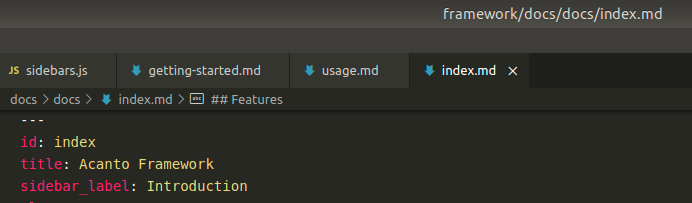

A set of multi-language packages (js, scss, php) to develop, deploy and mantain Acanto Frontend applications.

## Latest versions

- `"@olmokit/components"`: 
- `"@olmokit/core"`: 
- `"@olmokit/cli"`: 
- `"@olmokit/use"`: 
- `"olmo/laravel-frontend"`: 

## Features

- Hot Module Replacement
- JS/SCSS modules bundling with `webpack`
- SCSS compilation with `sass` and `postcss`
- SCSS optimization combining media queries with `postcss-sort-media-queries`
- ES6 syntax support with `babel`
- Routes specific JS/CSS
- CSS and JS files automatic splitting and cache busting (content hashed)
- Assets minification
- Images dynamic resizing, processing, minification and compression
- SVG inline icons automatic generation from `svg` images
- Favicons auto-generation from single image
- License banner for compiled `css` and `js` files
- Route and Component generator with `.js`, `.scss` and `.php` templates
