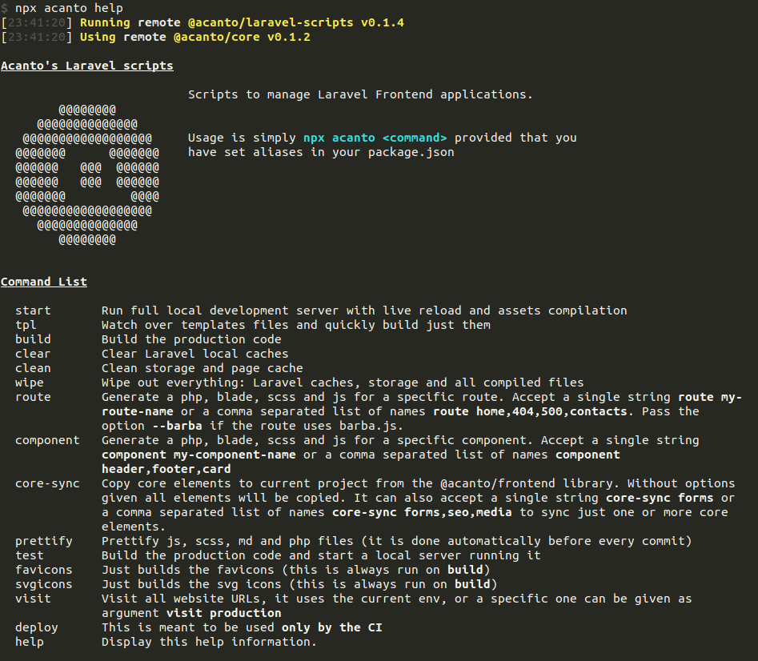

## Setup project

After `pnpm i` run `olmo start`

## Workflow commands

From your root folder run `olmo help` to view the available commands and their description.

## Generators

Routes can be created at any time running `olmo route route-name` or `olmo route route-one,route-two` to add multiple routes, existing routes will not be overwritten, but be careful of using a new **unique route name**. Same works for components with `olmo component MyComponent`.

## Caveats

### Windows

To run the script on windows you _might_ need to go to `System Properties` and on `Advanced -> Add to Environment variables -> Users -> Path` append the following variables:

- `C:\Program Files\Git\cmd` in order to be able to install npm packages directly from git remotes instead that from published versions git must be in the path [source](https://stackoverflow.com/a/44389219)
- `C:\Program Files\nodejs` to run node scripts from the current directory
